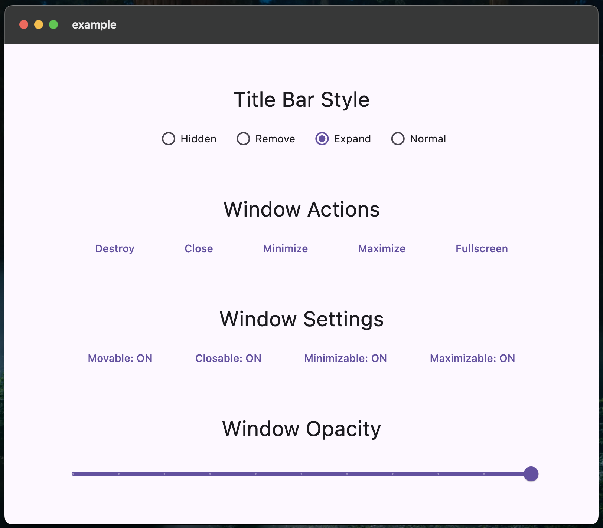

# window_toolkit

[![pub version][pub-image]][pub-url]

[pub-image]: https://img.shields.io/pub/v/window_toolkit.svg
[pub-url]: https://pub.dev/packages/window_toolkit


## Showcase

Below is a screenshot of the example app using `window_toolkit`:

<div align="center">
  <a href="https://github.com/Flutterlumin/window_toolkit.git">
    
  </a>
</div>


The **window_toolkit** is a Flutter plugin for macOS that simplifies customization of native window properties. It enables developers to control window behavior, style, and UI components like title bars, window alignment, resizing, and opacity. Future platform support is planned, making it adaptable for cross-platform development.


## Platform Support

| macOS |
| :---: |
|   ✔️   |


## Features

- **Window Management**: Control various window properties including movability, minimizability, maximizability, and more.
- **Title Bar Customization**: Adjust the visibility and style of the title bar.
- **Resizable Options**: Enable or disable window resizing based on user preferences.
- **Alignment and Positioning**: Center or align the window with predefined settings.
- **Opacity Control**: Dynamically adjust the window’s opacity.

Currently designed for macOS, with plans to support additional platforms in the future.


## Getting Started

To use window_toolkit, add it to your 'pubspec.yaml':

```yaml
dependencies:
  window_toolkit: ^0.1.2
```

Alternatively, add it directly from GitHub:

```yaml
dependencies:
  window_toolkit:
    git:
      url: https://github.com/Flutterlumin/window_toolkit.git
      ref: main
```

Then, import the package:

```dart
import 'package:window_toolkit/window_toolkit.dart';
```

### Usage

Here’s a basic example of how to use window_toolkit:

```dart
import 'package:flutter/material.dart';
import 'package:window_toolkit/window_toolkit.dart';

Future<void> main() async {
  WidgetsFlutterBinding.ensureInitialized();
  WindowToolkit toolkit = WindowToolkit.instance;
  await toolkit.initialize();
  await toolkit.titlebar(Titlebar(style: TitlebarStyle.expand));
  await toolkit.window(
    Window(minimumSize: Size(800, 700), size: (Size(800, 700)), center: true),
  );

  runApp(App());
}
```

### API Overview

- **WindowToolkit**: The core class responsible for managing and configuring window settings.
- **Define**: A class used to set and modify individual window properties, including movability, size, and opacity.
- **Check**: This class provides methods for verifying the current state of window properties, such as whether the window is minimized or in fullscreen mode.
- **Perform**: A class that encapsulates various actions that can be executed on the window, including minimizing, maximizing, and toggling fullscreen.


### License
This project is licensed under the [MIT License](LICENSE).

